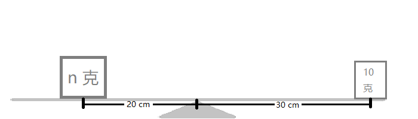

## 一只橙絮猿的自述
想知道我的年龄吗？  
先出道题，看看你有没有忘了小学知识
>“鼎”字的第**八**画的名称是什么？
>这个名称的音序是什么？
>这个音序在字母表中排第几（A 是第一，B 是第二，以此类推）？
>设上一个问题的结果为 n，有一个物体重 n 克，放在一个原本平衡的杠杆上，距离支点 20 厘米，在另一边有一个 10 克的物体，距离指点 30 厘米，如图：  
>
>
>
>
>
>
>
